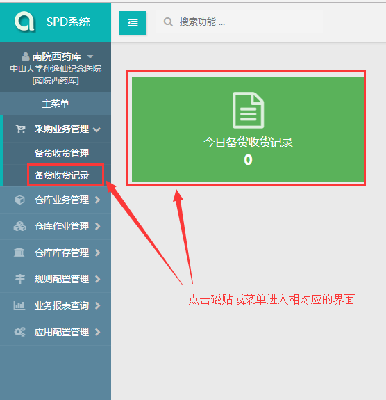
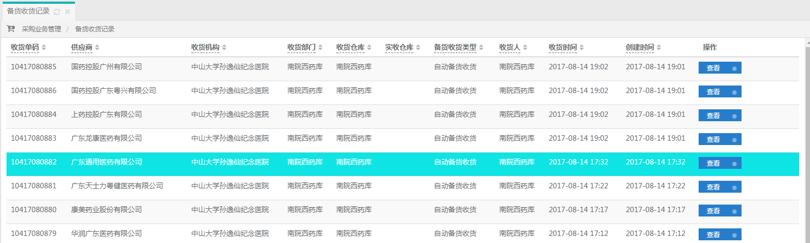

## 演示内容

### 操作流程图

### 查看收货

* 操作流程
  1. 通过点击菜单（备货收货记录）或磁贴（今日备货收货记录）进入到相对应的界面
  2. 进入到界面后通过点击查看按钮查看当前收货单的明细
* 操作界面

### 处理请领*

* 操作流程
  1. 通过点击菜单（申领计划管理）或磁贴（待处理申领）进入到相对应的界面

### 处理拣配*

## 演示反馈

### 需求

### bug

## 演示后交流

需要医院人员提供货位排序信息、账页数据、初始库存、初始用户账号及用户数量（建议使用操作人员的工号作为账号）、向库房进行请领的科室

##  评估

